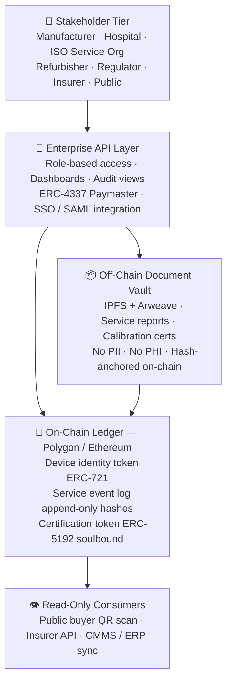

<div align="center">

# 🏥 MedPassport Protocol

## The cross-organizational evidence layer for regulated medical devices

[](LICENSE)
[](https://soliditylang.org/)
[](https://polygon.technology/)
[]()
[]()
[](CONTRIBUTING.md)
[](https://github.com/tomer-saar/medpassport-protocol/actions/workflows/test.yml)
[]()

<br/>

MedPassport is an open-source protocol that creates **permanent, independently verifiable
lifecycle records** for high-risk medical devices — solving the structural gap where
manufacturer cloud platforms, CMMS systems, and QMS databases cannot carry trust across
organizational boundaries.

<br/>

[📄 Whitepaper](docs/WHITEPAPER.md) &nbsp;·&nbsp;
[🏗️ Architecture](#architecture) &nbsp;·&nbsp;
[🔐 Security & Privacy](#-security--privacy) &nbsp;·&nbsp;
[🌍 Dual-Market](#-dual-market-readiness--eu-and-us) &nbsp;·&nbsp;
[🚀 Quick Start](#-quick-start) &nbsp;·&nbsp;
[🤝 Contributing](CONTRIBUTING.md)

</div>

---

## The Problem in Three Paragraphs

**The regulatory pressure:** MDR post-market surveillance, EUDAMED traceability (mandatory
May 2026, EU Decision 2025/2371), QMSR service records, and emerging Digital Product Passport
requirements all demand device-level evidence that persists across ownership transfers,
service providers, and decades of operational life.

**The architectural gap:** No existing system can create a neutral, tamper-evident record
that manufacturers, hospitals, refurbishers, and regulators all trust — without ceding
control to a single vendor or database operator. Proprietary cloud platforms stop at the
contract boundary. CMMS systems stop at the organizational boundary. EUDAMED records that
a device exists. None of them record what happens to the device after it leaves the
manufacturer's direct control.

**MedPassport's answer:** An open protocol (MIT licensed) that turns regulatory-mandated
device identity (UDI) into a cryptographic passport — carrying signed attestations from
every actor who touches the device, from factory floor to second life.

---

## The Four Structural Gaps

High-risk medical devices (Class IIb/III — CT, MRI, EEG, cardiology) operate under
strict regulation but are managed across a fragmented chain:
**OEM → distributor → hospital → ISO service lab → refurbisher → secondary buyer.**
At every organizational handoff, existing systems (CMMS, ERP, QMS) lose continuity.
The failure is not technological — it is architectural: every system serves a single
organization and cannot carry compliance and safety evidence across organizational
boundaries. **MedPassport covers the four structural gaps this creates.**

| Gap | The structural problem | Compliance consequence |
|---|---|---|
| **A — Offline / disconnected devices** | Many high-risk devices operate without continuous network connectivity (cybersecurity policy or infrastructure constraints). Service records are managed manually in local Excel files with no independent verification or unique link to the physical device identifier. | No regulatory-grade evidence trail for a significant portion of the deployed fleet. PSUR evidence gaps. FSCA notifications cannot reach affected units reliably. |
| **B — Ownership transfer breaks the chain** | When a device is sold to a secondary buyer or transferred to a distributor, the manufacturer's cloud connection is severed. Under EU MDR Art. 83, PMS obligations continue throughout the device's declared lifetime — regardless of ownership or contract status. Under FDA QMSR, MDR complaint reporting (21 CFR Part 803) and CAPA trend analysis obligations continue. | EU: PSUR evidence gaps for all transferred devices — a structural compliance breach. US: incomplete CAPA trend data and potential MDR reporting gaps for incidents involving transferred devices. |
| **C — ISO service dead zone and warranty loss** | A significant share of service contracts are performed by independent service organizations (ISOs). Their service data, component versions, and software states never reach the manufacturer. The manufacturer cannot produce a complete PSUR — and loses the ability to enforce warranty terms against improper service, non-OEM parts, or failure to install critical cybersecurity patches. | Incomplete PMS and PSUR evidence. Cannot verify 3rd party service quality. Manufacturer warranty protection lost. No proof that critical cybersecurity updates were installed on specific devices. FDA SBOM requirement: OEM cannot maintain a current Software Bill of Materials for ISO-serviced or resold devices without cross-organizational service records. |
| **D — Absence of independent evidence** | Technical and regulatory data stored only in the manufacturer's or hospital's internal systems is not considered independent third-party evidence. A notified body requires immutable, tamper-evident records not controlled by any commercially interested party. | Self-reported evidence carries lower regulatory weight. MedPassport creates tamper-evident records that no single party — including the manufacturer — can alter after writing. |

---

## Why This Matters Now

### Regulatory Tailwinds

- **EUDAMED mandatory 28 May 2026 (EU Decision 2025/2371):** Four modules active: Actor, UDI/Device, Notified Bodies, Market Surveillance. Registration confirms a device exists — PMS and PSUR evidence obligations continue after registration.
- **EUDAMED legacy device deadline 28 November 2026:** All devices placed on the EU market before 28 May 2026 and still being sold must be registered by this date.
- **EUDAMED Vigilance & PMS module — expected Q4 2026 notice → ~Q2 2027 mandatory:** When this module activates, PSURs and serious incident reports must be submitted digitally through EUDAMED. MedPassport is the evidence infrastructure that feeds this submission — cross-organizational, tamper-evident, query-ready.
- **QMSR enforcement Feb 2026:** FDA's alignment with ISO 13485 makes service and
  complaint traceability central to US QMS inspections. EU compliance through
  MedPassport delivers 80% of QMSR compliance automatically.
- **EU Digital Product Passport (ESPR 2024/1781):** No medical device-specific delegated act has been adopted as of May 2026. The JRC methodology was published March 2026 — a precursor to a delegated act, with enforcement realistically 2028-2029. MedPassport architecture is already DPP-aligned. *Note: EU regulatory timelines consistently slip 6-12 months from initial estimates — all indicative dates should be treated as approximate.*

### Market Dynamics

- **$21B refurbished medical device market** (2026, 9–11% CAGR) where 30–50% price
  discount is applied to devices with unverifiable service history.
- **$50B+ total medical device service market** (OEM + independent service) with zero
  neutral evidence standard across organizational boundaries.
- **Distributor legal exposure:** Local distributors face significant liability in FSCA
  events without tamper-evident proof they fulfilled their duty to transmit regulatory
  notifications.

---

## Protocol Design Principles

| Principle | Implementation |
|---|---|
| **Zero-PII on-chain** | Only hashes, attestations, UDI identifiers, and organizational credentials reach the ledger. No PII or PHI is architecturally possible on-chain. |
| **Append-only integrity** | Events are signed attestations. Nothing is deleted or overwritten. Corrections append a superseding record — the full audit trail is always preserved. |
| **Headless integration** | Field technicians take zero additional steps. The protocol reads from ServiceMax / Infor EAM work order closures automatically. Barcode scan fallback for non-integrated environments. |
| **Neutral scoring** | Compliance scores reflect actual device condition — not vendor loyalty. OEM and qualified ISO service both receive full credit for on-time, passing events. |
| **Gasless enterprise UX** | ERC-4337 account abstraction. No enterprise participant manages crypto wallets or native tokens. Costs settle via standard SaaS billing. |
| **Mutual Attestation** | Cross-organizational events require cryptographic consent from all parties involved — no single actor can write to another's device record unilaterally. |
| **Open protocol, paid network** | Smart contracts and schemas are MIT-licensed. Revenue comes from managed SaaS, integration services, and certification services built on top. |

---

## Architecture



---

## Smart Contract Stack

Ten contracts deployed in dependency order:

| Layer | Contract | Purpose |
|---|---|---|
| **Types** | `DeviceTypes.sol` | Shared enums and structs — the protocol dictionary |
| **Access** | `CredentialRegistry.sol` | Credential states — ACTIVE, REVOKED, INACTIVE, MIGRATED |
| **Access** | `RoleManager.sol` | Role-based permission enforcement for every write path |
| **Access** | `MigrationGovernance.sol` | Multisig M&A and credential succession handling |
| **Core** | `DevicePassportNFT.sol` | ERC-721 device identity token — one per physical device |
| **Core** | `ServiceLogRegistry.sol` | Append-only lifecycle event log — 10 event types, 3 integrity flags per event |
| **Core** | `CorrectionRegistry.sol` | Dispute and correction chain — SUPERSEDES, DISPUTES, AMENDS |
| **Core** | `TransferManager.sol` | Dual-signature ownership transfer with 72h expiry |
| **Compliance** | `ComplianceScorer.sol` | Decay-from-100 compliance score — new device = 100, deductions on deviation |
| **Compliance** | `CertificationSBT.sol` | ERC-5192 soulbound trust stamp — Bronze, Silver, Gold |

### Compliance Scoring Model — Decay from 100

MedPassport uses a **decay-from-100** scoring model. A new CE-marked device starts at 100/100.
Deductions are applied when service is overdue, parts are undocumented, or complaints are open.

```
New device at manufacture:         100/100
PM overdue 0-3 months:              95/100  (-5 points)
PM overdue 3-6 months:              85/100  (-15 points)
PM overdue 6+ months:               75/100  (-25, full component lost)
Active recall or decommissioned:     0/100  (hard zero)

Component weights (default — configurable per manufacturer):
  Calibration compliance:    25 pts
  PM compliance:             25 pts
  Inspection compliance:     20 pts
  Software currency:         10 pts
  Parts integrity:           10 pts
  Clean complaint record:    10 pts

Certification thresholds:
  GOLD:   90-100
  SILVER: 75-89
  BRONZE: 60-74
  Below 60: Not certifiable
```

---

## Wave 1 Pilot — Class IIb/III Medical Devices

**Six lifecycle event types:**

| Event | Primary data source | Fallback |
|---|---|---|
| `TransferEvent` | CMMS work order closure | Barcode scan at installation |
| `ServiceEvent` | CMMS API adapter (ServiceMax / Infor EAM) | Barcode scan + structured form |
| `CalibrationEvent` | CMMS attachment + PDF hash | Manual upload via mobile app |
| `ComplaintEvent` | QMS complaint module (two-phase) | Manual entry by RA team |
| `FSCAEvent` | QMS FSCA tracking + CMMS | Dashboard entry |
| `RefurbishmentEvent` | Refurbisher QMS | Wave 2 |

**Two data collection paths:**
- **Path A:** CMMS API reads closed work orders automatically — zero technician action required
- **Path B:** Barcode scan + structured form — 60 seconds per event, no IT integration needed.
  Includes Offline-to-Online sync for sites without continuous connectivity.

**Wave 1 success metrics (9–12 month pilot):**

| Metric | Target |
|---|---|
| FSCA identification time | <4 hours for 100% of pilot fleet |
| Work order capture rate | ≥95% of closed work orders captured automatically |
| Audit prep reduction | ≥30% reduction vs baseline |
| Data completeness | ≥90% of work orders + ≥40 events |
| Cross-org participation | 100% dual-signature compliance on all transfers |
| Zero workflow addition | 0 new manual tasks for field technicians |

---

## 🔐 Security & Privacy

### Zero-PII three-layer architecture

| Layer | What lives here | Who can access |
|---|---|---|
| **Your systems** (CMMS/QMS/ERP) | Customer names, contracts, pricing, full service notes | Your RA and service teams only — no external access ever |
| **Encrypted vault** (IPFS/Arweave) | Calibration certificates, sanitised event summaries, document hashes | Device owner (full), notified body (read-only grant), competitor (no access) |
| **On-chain ledger** (Polygon) | 64-character cryptographic hash, timestamp, credential ID | Anyone — a competitor sees only a random string. Mathematically impossible to reverse. |

### Append-only integrity

Events are signed attestations. Corrections append a superseding record referencing
the original hash. Nothing is deleted.

### Dual-signature for high-risk events

Ownership transfer and certification require two independent credentialed actors.
Neither can complete the action unilaterally.

### GDPR compliant by design

Zero PII on-chain. Data minimisation enforced at the schema level. Right to erasure
applies to vault documents. On-chain records show an event occurred — not personal details.

### GAMP 5 aligned

Managed SaaS classified as GAMP 5 Category 4. Full Validation Support Package at
enterprise onboarding.

---

## Regulatory Alignment

| Framework | Jurisdiction | Key coverage |
|---|---|---|
| **ISO 13485:2016** | Global | §7.5.8 Traceability · §8.2.1 Feedback · §8.3 Nonconforming product |
| **EU MDR 2017/745** | EU | Art. 27 UDI · Art. 83 PMS · Art. 87 Incident reporting |
| **EUDAMED** | EU | Mandatory from 28 May 2026 · UDI registration · Actor registration |
| **EU ESPR 2024/1781** | EU | DPP-ready architecture · JRC methodology aligned |
| **FDA QMSR 21 CFR 820** | US | §820.10 UDI · §820.35 Records · §820.65 Traceability · §820.100 CAPA trend analysis · §820.200 Servicing (where specified) · 21 CFR Part 803 MDR complaint reporting |
| **FDA GUDID** | US | Live UDI-DI validation bridge — AccessGUDID API verified |
| **21 CFR Part 11** | US | Audit trail · unique identification · record retrieval |

---

## 🌍 Dual-Market Readiness — EU and US

| Market | Registry | Status |
|---|---|---|
| 🇪🇺 EU | EUDAMED — mandatory from 28 May 2026 | ✅ Architecture complete · EUDAMED bridge Phase 2 |
| 🇺🇸 US | FDA GUDID — QMSR in effect February 2026 | ✅ Live GUDID bridge · AccessGUDID API verified |
| 🌐 Both | Single deployment, dual validation at mint | ✅ Dual UDI fields · jurisdiction flagging complete |

FDA's QMSR incorporates ISO 13485:2016 by reference. EU compliance through MedPassport delivers 80% of US QMSR compliance automatically — specifically through CAPA trend analysis (§820.100), complaint reporting completeness (21 CFR Part 803), and UDI traceability (21 CFR Part 830), all of which require cross-organizational service evidence that MedPassport provides.

> *Enterprise Addendum (pricing, ROI analysis, pilot definition) available on request —
> [LinkedIn](https://www.linkedin.com/in/tomer-saar/)*

---

## Competitive Positioning

| Capability | VeChain DPP | ServiceMax / PTC | MedPassport |
|---|---|---|---|
| Cross-organizational evidence | Partial | No — single org only | ✅ Core design |
| MDR PMS / PSUR alignment | No | No | ✅ Built-in |
| FSCA execution support | No | Partial | ✅ Built-in |
| Neutral scoring (not OEM-biased) | N/A | N/A | ✅ Core design |
| Open source | Partial | No | ✅ MIT |
| Zero-PII on-chain | Yes | N/A | ✅ Yes |
| Works without IT integration | No | No | ✅ Barcode fallback |
| Dual-signature cross-org events | No | No | ✅ Core design |

---

## 📄 Documentation

| Document | Description |
|---|---|
| [Whitepaper](docs/WHITEPAPER.md) | Protocol overview — problem, solution, regulatory framework, dual-market readiness |
| [ADR-000 Protocol Axioms](docs/adrs/ADR-000-protocol-axioms.md) | The five constitutional rules every contract must uphold |
| [ADR-001 Credential States](docs/adrs/ADR-001-credential-states.md) | Role matrix and credential state transitions |
| [ADR-010 VeChain Learnings](docs/adrs/ADR-010-vechain-competitive-learnings.md) | Protocol enhancements: batch transactions + Studio portal |
| [Event Taxonomy](docs/event-model/EVENT-TAXONOMY.md) | All event types, write authority, and edge cases |
| [Sequence Diagrams](docs/architecture/SEQUENCE-DIAGRAMS.md) | Step-by-step flows for ownership transfer and certification |

---

## 🚀 Quick Start

```bash
git clone https://github.com/tomer-saar/medpassport-protocol.git
cd medpassport-protocol
forge install
forge build
forge test
```

Expected output: `80 tests passing · 0 failed`

---

## 🗺️ Roadmap

- [x] **Sprint 0** — Protocol design · axioms · event taxonomy · sequence diagrams
- [x] **Sprint 1** — Identity and governance · CredentialRegistry · RoleManager · MigrationGovernance
- [x] **Sprint 2** — Core lifecycle · DevicePassportNFT · ServiceLogRegistry · CorrectionRegistry · TransferManager
- [x] **Sprint 3** — Compliance layer · ComplianceScorer · CertificationSBT · 80 tests passing
- [x] **Sprint 4** — Deployment scripts · live demo · CT scanner pilot verified on-chain
- [x] **Sprint 5** — Live GUDID bridge · AccessGUDID API verified · dual-market UDI fields
- [x] **Sprint 6** — ComplianceScorer v2 decay model · configurable weights · ServiceEvent integrity flags
- [x] **Phase 2 / Sprint 7 (complete)** — Polygon Amoy testnet ✅ LIVE · `batchLog()` ✅ · SBOM hash field ✅ · Role-based demo v2 ✅ deployed
- [ ] **Phase 2 / Sprint 8** — CMMS Headless Adapter (ServiceMax + Infor EAM) · Offline-to-Online sync · MDR/EUDAMED regulatory deliverable
- [ ] **Phase 2 / Sprint 9** — Pilot execution · 10–20 Class IIb devices on-chain · ComplianceScorer calibration against real field data
- [ ] **Phase 2 / Sprint 10** — FSCA simulation · TRL 6 validation · first published FSCA reach rate benchmark
- [ ] **Phase 3** — MedPassport Studio low-code portal · Vigilance Analytics · dual-market onboarding · insurer API

---

## ✅ Live Demo Results

```
PASSPORT STATUS - CardioScan Pro 3000
======================================
Token ID:         1
UDI:              00844588003288/LOT2023-Q1/SN00432
Service events:   4 (PM, Calibration, Inspection, SW Update)
Compliance score: 100 / 100
Certified:        GOLD
Recall active:    false
Testnet:          Polygon Amoy (Chain ID 80002)
Block deployed:   38,793,859
======================================
Contracts live on Polygon Amoy testnet:
  CredentialRegistry:  0x86212ddCD3FBcb470D311f1139B12DC8009b79D8
  RoleManager:         0xB2ab2c71Ab58652cb78a78Ed6c803eb53659eC5f
  MigrationGovernance: 0x68C90BD6F8760053299dcC6F585A244C31173185
  DevicePassportNFT:   0x9C0395d74A24E588F1653b0866e2fdE4092623BF
  ServiceLogRegistry:  0xc45a6e3aA2d5A505d6c4d1bbeE6ae3DFfe5E29e7
  CorrectionRegistry:  0x8Dda4E49ADbBD57f74BC3814d880120d8D5fc762
  TransferManager:     0x97B887D935d7094d7e302e3e531089f5D865D986
  ComplianceScorer:    0x8168e27440e3064F61765DB294002CE634E6c286
  CertificationSBT:    0xeFb2a996F76B0Ec515a658074830477EB3c68F74
Verify: https://amoy.polygonscan.com/address/0x86212ddCD3FBcb470D311f1139B12DC8009b79D8
```

---

## Business Model

**Open protocol + paid enterprise network** (HashiCorp / Confluent model)

Smart contracts and event schemas are MIT-licensed and free to use. Revenue comes from
the managed SaaS layer — dashboards, PSUR exports, compliance analytics, and CMMS
integrations built on top of the open protocol.

> *Pricing and tier details available in the Enterprise Addendum — request via
> [LinkedIn](https://www.linkedin.com/in/tomer-saar/)*

---

## 👤 Author

**Tomer Saar, PMP**
20+ years in Medical Device Industry
R&D · Engineering · Manufacturing Management at Tier-1 Global Leaders
Co-inventor on multiple granted patents in implantable cardiac devices and motion systems

[](https://www.linkedin.com/in/tomer-saar/)

**Research Lead & Industry Advisor: Dr. Shlomo Gilat**
DSc Biomedical Engineering, Technion · 35+ years Class IIb/III · 2 US patents · 22 publications

---

## 🤝 Contributing

Contributions welcome from Solidity developers, medical device professionals,
healthcare IT specialists, and security researchers.

See [CONTRIBUTING.md](CONTRIBUTING.md) to get started.

---

## ⚖️ License

MIT License · Not legal, medical, or regulatory advice.

---

<div align="center">

**If this project is useful to you, please ⭐ star the repo**

</div>
