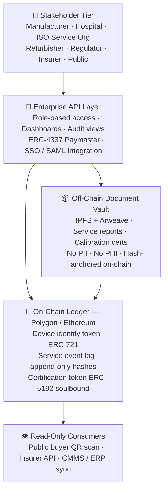

<div align="center">

# 🏥 MedPassport Protocol

### Cross-organizational trust infrastructure for regulated medical device lifecycles

[](LICENSE)
[](https://soliditylang.org/)
[](https://polygon.technology/)
[]()
[]()
[](CONTRIBUTING.md)
[](https://github.com/tomer-saar/medpassport-protocol/actions/workflows/test.yml)
[]()

<br/>

**MedPassport is an open-source protocol that assigns every medical device a permanent,
tamper-evident Digital Product Passport — carrying lifecycle evidence across the
organizational handoffs where today's systems go silent.**

<br/>

[📄 Whitepaper](docs/WHITEPAPER.md) &nbsp;·&nbsp;
[🏗️ Architecture](#architecture) &nbsp;·&nbsp;
[🔐 Security & Privacy](#-security--privacy) &nbsp;·&nbsp;
[🌍 Dual-Market](#-dual-market-readiness--eu-and-us) &nbsp;·&nbsp;
[🚀 Quick Start](#-quick-start) &nbsp;·&nbsp;
[🤝 Contributing](CONTRIBUTING.md)

</div>

---

## The Problem This Solves

Medical device lifecycle data crosses six organizational boundaries — manufacturer,
distributor, hospital, ISO service organization, refurbisher, and secondary buyer.
At every handoff, existing systems go silent.

The consequence is structural:

- Recalls take weeks to reach affected devices because post-distribution visibility
  depends on voluntary reporting from downstream holders
- Audit preparation takes days because evidence is assembled from 3–8 disconnected
  systems under time pressure
- Refurbished devices sell at 30–50% discount because buyers cannot independently
  verify service history
- Warranty disputes take 30–90 days because both parties work from competing paper records

**This is not a software problem. It is an architectural one.** No existing platform
carries device evidence across organizational boundaries without depending on a single
trusted operator. MedPassport removes the need for that operator.

---

## Protocol Design Principles

| Principle | Implementation |
|---|---|
| **Zero-PII on-chain** | Only hashes, attestations, UDI identifiers, and organizational credentials reach the ledger. No PII or PHI is architecturally possible on-chain. |
| **Append-only integrity** | Events are signed attestations. Nothing is deleted or overwritten. Corrections append a superseding record — the full audit trail is always preserved. |
| **Headless integration** | Field technicians take zero additional steps. The protocol reads from ServiceMax / Infor EAM work order closures automatically. |
| **Gasless enterprise UX** | ERC-4337 account abstraction. No enterprise participant manages crypto wallets or native tokens. Costs settle via standard SaaS billing. |
| **Open protocol, paid network** | Smart contracts and schemas are MIT-licensed. Revenue comes from managed SaaS, integration services, and certification fees built on top. |

---

## Architecture



---

## Smart Contract Stack

Ten contracts deployed in dependency order:

| Layer | Contract | Purpose |
|---|---|---|
| **Types** | `DeviceTypes.sol` | Shared enums and structs — the protocol dictionary |
| **Access** | `CredentialRegistry.sol` | Credential states — ACTIVE, REVOKED, INACTIVE, MIGRATED |
| **Access** | `RoleManager.sol` | Role-based permission enforcement for every write path |
| **Access** | `MigrationGovernance.sol` | Multisig M&A and credential succession handling |
| **Core** | `DevicePassportNFT.sol` | ERC-721 device identity token — one per physical device |
| **Core** | `ServiceLogRegistry.sol` | Append-only lifecycle event log — 10 event types |
| **Core** | `CorrectionRegistry.sol` | Dispute and correction chain — SUPERSEDES, DISPUTES, AMENDS |
| **Core** | `TransferManager.sol` | Dual-signature ownership transfer with 72h expiry |
| **Compliance** | `ComplianceScorer.sol` | Weighted 0-100 compliance score from service history |
| **Compliance** | `CertificationSBT.sol` | ERC-5192 soulbound trust stamp — Bronze, Silver, Gold |

---

## 🔐 Security & Privacy

### Zero-PII architecture

No PII or PHI is ever written to the ledger. Enforced at three independent levels —
protocol, API gateway, and tenant configuration. No override exists.

### Append-only integrity

Events are signed attestations. Corrections append a superseding record referencing
the original hash. The original is permanently preserved. Nothing is deleted.

### Dual-signature for high-risk events

Ownership transfer and certification require two independent credentialed actors.
Neither can complete the action unilaterally.

### GAMP 5 aligned

Managed SaaS classified as GAMP 5 Category 4. Full Validation Support Package
provided at enterprise onboarding — IQ/OQ/PQ templates, traceability matrix,
risk assessment.

---

## Regulatory Alignment

| Framework | Jurisdiction | Key coverage |
|---|---|---|
| **ISO 13485:2016** | Global | §7.5.8 Traceability · §8.2.1 Feedback · §8.3 Nonconforming product |
| **EU MDR 2017/745** | EU | Art. 27 UDI · Art. 83 PMS · Art. 87 Incident reporting |
| **EUDAMED** | EU | 4 modules mandatory 28 May 2026 · UDI registration · Actor registration |
| **EU ESPR 2024/1781** | EU | DPP-ready architecture · JRC methodology aligned |
| **FDA QMSR 21 CFR 820** | US | §820.10 UDI · §820.35 Records · §820.65 Traceability · §820.200 Servicing |
| **FDA GUDID** | US | UDI-DI validation bridge · QMSR inspection-ready |
| **21 CFR Part 11** | US | Audit trail · unique identification · record retrieval |

---

## 🌍 Dual-Market Readiness — EU and US

MedPassport is designed for global deployment from a single protocol implementation.

| Market | Registry | Status |
|---|---|---|
| 🇪🇺 EU | EUDAMED — 4 modules mandatory from 28 May 2026 | ✅ Designed — EUDAMED bridge in Phase 2 |
| 🇺🇸 US | FDA GUDID — QMSR in effect February 2026 | ✅ Designed — GUDID bridge in Phase 2 |
| 🌐 Both | Single deployment, dual validation at mint | ✅ Architecture complete |

**Why ISO 13485 makes this efficient:**
FDA's QMSR incorporates ISO 13485:2016 by reference. EU compliance through MedPassport
delivers 80% of US QMSR compliance automatically. Three targeted additions — dual UDI
fields, GUDID bridge, and jurisdiction flagging — complete the picture.

> *Enterprise Addendum covering deployment architecture, governance model, GAMP 5
> validation, dual-market integration, pilot definition, and ROI benchmarks available
> on request — [contact via LinkedIn](https://www.linkedin.com/in/tomer-saar/)*

---

## 📄 Documentation

Every architectural decision is documented, justified, and traceable to a regulatory
requirement before any contract code is written.

| Document | Description |
|---|---|
| [Whitepaper v1.2](docs/WHITEPAPER.md) | Full protocol whitepaper — problem, solution, regulatory framework, dual-market readiness |
| [ADR-000 Protocol Axioms](docs/adrs/ADR-000-protocol-axioms.md) | The five constitutional rules every contract must uphold |
| [ADR-001 Credential States](docs/adrs/ADR-001-credential-states.md) | Role matrix and credential state transitions |
| [Event Taxonomy](docs/event-model/EVENT-TAXONOMY.md) | All event types, write authority, and edge cases |
| [Sequence Diagrams](docs/architecture/SEQUENCE-DIAGRAMS.md) | Step-by-step flows for ownership transfer and certification |

---

## 🚀 Quick Start

```bash
git clone https://github.com/tomer-saar/medpassport-protocol.git
cd medpassport-protocol
forge install
forge build
forge test
```

---

## 🗺️ Roadmap

- [x] **Sprint 0** — Protocol design documents · axioms · event taxonomy · sequence diagrams
- [x] **Sprint 1** — Identity and governance · CredentialRegistry · RoleManager · MigrationGovernance
- [x] **Sprint 2** — Core lifecycle · DevicePassportNFT · ServiceLogRegistry · CorrectionRegistry · TransferManager
- [x] **Sprint 3** — Compliance layer · ComplianceScorer · CertificationSBT
- [x] **Sprint 4** — Deployment scripts · live demo · CT scanner pilot verified on-chain
- [ ] **Phase 2** — EUDAMED bridge · GUDID bridge · CMMS adapter · IPFS storage · mainnet deployment
- [ ] **Phase 3** — Dual-market onboarding · managed SaaS · insurer API · EUDAMED Vigilance feed
- [ ] **Phase 4** — ESPR medical device delegated act · OPC-UA IoT connector · academic publication

---

## ✅ Live Demo Results

The complete CT scanner pilot workflow was executed and verified on-chain:

```
PASSPORT STATUS - CardioScan Pro 3000
======================================
Token ID:         1
UDI:              00844588003288/LOT2026-001/SN00432
Service events:   4 (PM, Calibration, Inspection, SW Update)
Compliance score: 100 / 100
Certified:        true
Cert level:       GOLD
Recall active:    false
======================================
Full workflow verified:
  Passport minted by manufacturer
  Dual-signature ownership transfer to hospital
  4 service events logged on-chain
  Compliance score calculated automatically
  Gold certification issued via dual-signature
  Full history preserved across all transfers
```

---

## Enterprise Inquiries

MedPassport maintains a separate Enterprise Addendum covering deployment architecture,
governance model, GAMP 5 validation, dual-market integration, pilot definition, and
ROI benchmarks.

Shared directly with qualified enterprise contacts on request.

**Contact:** [LinkedIn — Tomer Saar](https://www.linkedin.com/in/tomer-saar/)

---

## 👤 Author

**Tomer Saar, PMP**
20+ years in Medical Device Industry
R&D · Engineering · Manufacturing Management at Tier-1 Global Leaders
Currently deepening blockchain expertise to build the trust infrastructure this
industry is missing.

[](https://www.linkedin.com/in/tomer-saar/)

---

## 🤝 Contributing

Contributions welcome from Solidity developers, medical device professionals,
healthcare IT specialists, and security researchers.

See [CONTRIBUTING.md](CONTRIBUTING.md) to get started.

---

## ⚖️ License

MIT License · Not legal, medical, or regulatory advice.

---

<div align="center">

**If this project is useful to you, please ⭐ star the repo**

</div>
