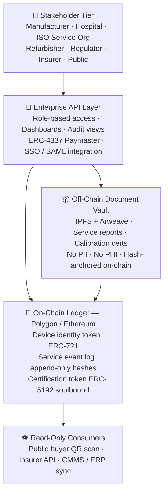

<div align="center">

# 🏥 MedPassport Protocol

## The cross-organizational evidence layer for regulated medical devices

[](LICENSE)
[](https://soliditylang.org/)
[](https://polygon.technology/)
[]()
[]()
[](CONTRIBUTING.md)
[](https://github.com/tomer-saar/medpassport-protocol/actions/workflows/test.yml)
[]()

<br/>

MedPassport is an open-source protocol that creates **permanent, independently verifiable
lifecycle records** for high-risk medical devices — solving the structural gap where
manufacturer cloud platforms, CMMS systems, and QMS databases cannot carry trust across
organizational boundaries.

<br/>

[📄 Whitepaper](docs/WHITEPAPER.md) &nbsp;·&nbsp;
[🏗️ Architecture](#architecture) &nbsp;·&nbsp;
[🔐 Security & Privacy](#-security--privacy) &nbsp;·&nbsp;
[🌍 Dual-Market](#-dual-market-readiness--eu-and-us) &nbsp;·&nbsp;
[🚀 Quick Start](#-quick-start) &nbsp;·&nbsp;
[🤝 Contributing](CONTRIBUTING.md)

</div>

---

## The Problem in Three Paragraphs

**The regulatory pressure:** MDR post-market surveillance, EUDAMED traceability,
QMSR service records, and emerging Digital Product Passport requirements all demand
device-level evidence that persists across ownership transfers, service providers,
and decades of operational life.

**The architectural gap:** No existing system can create a neutral, tamper-evident
record that manufacturers, hospitals, refurbishers, and regulators all trust —
without ceding control to a single vendor or database operator. Proprietary cloud
platforms stop at the contract boundary. CMMS systems stop at the organizational
boundary. EUDAMED records that a device exists. None of them record what happens
to the device after it leaves the manufacturer's direct control.

**MedPassport's answer:** An open protocol (MIT licensed) with a paid managed
network that turns regulatory-mandated device identity (UDI) into a cryptographic
passport — carrying signed attestations from every actor who touches the device,
from factory floor to second life.

---

## The Four Gaps in Detail

Modern Class IIb and III devices maintain continuous cloud connectivity — giving
manufacturers real-time status, remote software tracking, and direct service dispatch.
That investment works well within its boundary. **MedPassport covers the four
boundaries where cloud stops.**

| Boundary | Where cloud stops | Compliance consequence |
|---|---|---|
| **1 — Device age** | Devices older than ~15 years have no cloud interface. Legacy fleet is a complete blind spot yet still subject to MDR PMS obligations. | PSUR evidence gaps. FSCA cannot reach affected units without manual distributor chains. |
| **2 — Ownership transfer** | When a device is sold to a secondary buyer, the cloud connection is severed. Warranty expires, contract ends, new owner does not renew. | PMS evidence gaps for devices no longer under service contract but still in clinical use. MDR Art. 83 obligations do not end at contract expiry. |
| **3 — 3rd party service** | When a hospital engages an ISO instead of the OEM team, that service data never enters the manufacturer's cloud. Calibrations, PM events, and parts replacements are invisible. | Cannot verify quality of 3rd party service. Incomplete PMS evidence. Inability to demonstrate full lifecycle compliance to a notified body. |
| **4 — Regulatory independence** | Cloud data is controlled by the manufacturer. A notified body cannot independently verify it has not been modified after the fact. | Self-reported evidence carries lower regulatory weight. MedPassport creates tamper-evident records that no single party — including the manufacturer — can alter after writing. |

---

## Why This Matters Now — Investor View

### Regulatory Tailwinds

- **EUDAMED mandatory 28 May 2026:** All MDR/IVDR devices must be registered with UDI; legacy devices by 27 Nov 2026. Manufacturers must operationalize device-level identity infrastructure anyway — MedPassport turns that compliance cost into a strategic asset.
- **QMSR enforcement 2 Feb 2026:** FDA's alignment with ISO 13485 makes service and complaint traceability central to US QMS inspections. EU compliance through MedPassport delivers 80% of QMSR compliance automatically.
- **EU Digital Product Passport (ESPR):** Medical device delegated acts expected Q4 2026–Q1 2027 will require lifecycle transparency fields MedPassport already captures.

### Market Dynamics

- **$9B+ refurbished medical device market** (Grand View Research, 2024) where 30–50% price discount is applied to devices with unverifiable service history — a discount MedPassport eliminates with verified records.
- **$50B+ total medical device service market** (OEM + independent service) with zero neutral evidence standard across organizational boundaries.
- **Post-market surveillance pain:** Every Class IIb/III manufacturer faces annual PSUR and PMS plan requirements with fragmented data sources across disconnected systems.

### Competitive Moat

- **Network effect:** Value increases with each additional stakeholder — hospital, refurbisher, ISO — creating cross-side network dynamics no single-vendor platform can replicate.
- **Governance model:** Open protocol removes the "who controls the database?" objection that kills centralized solutions in multi-party, competitive environments.
- **Regulatory-native design:** Built explicitly around UDI, MDR vigilance, QMSR traceability, and DPP requirements — not generic blockchain or PLM adapted after the fact.

### Business Model

- **Open protocol (MIT), paid network:** Smart contracts and schemas are open-source. Revenue from managed SaaS, CMMS/QMS integrations, certification services, and premium data API.
- **Wave 1 customer:** Medical device OEMs (VP Regulatory + VP Service) under MDR/QMSR compliance pressure — annual subscription + onboarding fee based on fleet size.
- **Wave 2+:** Hospitals, refurbishers, insurers, and regulators as network participants and data consumers.

---

## Protocol Design Principles

| Principle | Implementation |
|---|---|
| **Zero-PII on-chain** | Only hashes, attestations, UDI identifiers, and organizational credentials reach the ledger. No PII or PHI is architecturally possible on-chain. |
| **Append-only integrity** | Events are signed attestations. Nothing is deleted or overwritten. Corrections append a superseding record — the full audit trail is always preserved. |
| **Headless integration** | Field technicians take zero additional steps. The protocol reads from ServiceMax / Infor EAM work order closures automatically. Barcode scan fallback for non-integrated environments. |
| **Neutral scoring** | Compliance scores reflect actual device condition — not vendor loyalty. OEM and qualified ISO service both receive full credit for on-time, passing events. The OEM advantage is operational (tighter CMMS integration) not algorithmic. |
| **Gasless enterprise UX** | ERC-4337 account abstraction. No enterprise participant manages crypto wallets or native tokens. Costs settle via standard SaaS billing. |
| **Open protocol, paid network** | Smart contracts and schemas are MIT-licensed. Revenue comes from managed SaaS, integration services, and certification fees built on top. |

---

## Architecture



---

## Smart Contract Stack

Ten contracts deployed in dependency order:

| Layer | Contract | Purpose |
|---|---|---|
| **Types** | `DeviceTypes.sol` | Shared enums and structs — the protocol dictionary |
| **Access** | `CredentialRegistry.sol` | Credential states — ACTIVE, REVOKED, INACTIVE, MIGRATED |
| **Access** | `RoleManager.sol` | Role-based permission enforcement for every write path |
| **Access** | `MigrationGovernance.sol` | Multisig M&A and credential succession handling |
| **Core** | `DevicePassportNFT.sol` | ERC-721 device identity token — one per physical device |
| **Core** | `ServiceLogRegistry.sol` | Append-only lifecycle event log — 10 event types, 3 integrity flags per event |
| **Core** | `CorrectionRegistry.sol` | Dispute and correction chain — SUPERSEDES, DISPUTES, AMENDS |
| **Core** | `TransferManager.sol` | Dual-signature ownership transfer with 72h expiry |
| **Compliance** | `ComplianceScorer.sol` | Decay-from-100 compliance score — new device = 100, deductions on deviation |
| **Compliance** | `CertificationSBT.sol` | ERC-5192 soulbound trust stamp — Bronze, Silver, Gold |

### Compliance Scoring Model — Decay from 100

MedPassport uses a **decay-from-100** scoring model. A new CE-marked device starts at 100/100.
Deductions are applied when service is overdue, parts are undocumented, or complaints are open.

```
New device at manufacture:         100/100  (most compliant state)
PM overdue 0-3 months:              95/100  (-5 points)
PM overdue 3-6 months:              85/100  (-15 points)
PM overdue 6+ months:               75/100  (-25, full component lost)
Active recall or decommissioned:     0/100  (hard zero)

Component weights (default — configurable per manufacturer):
  Calibration compliance:    25 pts
  PM compliance:             25 pts
  Inspection compliance:     20 pts
  Software currency:         10 pts
  Parts integrity:           10 pts
  Clean complaint record:    10 pts

Certification thresholds:
  GOLD:   90-100  (device maintained to spec)
  SILVER: 75-89   (minor deviations)
  BRONZE: 60-74   (certifiable, attention needed)
  Below 60: Not certifiable
```

---

## Wave 1 Pilot — Class IIb/III Medical Devices

The Wave 1 pilot targets a single OEM manufacturer with a Class IIb/III device fleet,
2–3 hospitals, and 1 certified refurbisher participating as a transfer recipient.

**Six lifecycle event types:**

| Event | Primary data source | Fallback |
|---|---|---|
| `TransferEvent` | CMMS work order closure | Barcode scan at installation |
| `ServiceEvent` | CMMS API adapter (ServiceMax / Infor EAM) | Barcode scan + structured form |
| `CalibrationEvent` | CMMS attachment + PDF hash | Manual upload via mobile app |
| `ComplaintEvent` | QMS complaint module (two-phase) | Manual entry by RA team |
| `FSCAEvent` | QMS FSCA tracking + CMMS | Dashboard entry |
| `RefurbishmentEvent` | Refurbisher QMS (Wave 2) | Wave 2 only |

**Two data collection paths:**
- **Path A:** CMMS API reads closed work orders automatically — zero technician action required
- **Path B:** Barcode scan + structured form — 60 seconds per event, no IT integration needed

**Wave 1 success metrics (9–12 month pilot):**

| Metric | Target | Method |
|---|---|---|
| FSCA identification time | <4 hours for 100% of fleet | Simulated FSCA at month 9 — full execution loop |
| Audit prep reduction | ≥30% vs baseline | Compare hours before/after for annual audit cycle |
| Data completeness | ≥90% of work orders + ≥40 events | CMMS reconciliation audit |
| Cross-org participation | 100% dual-signature compliance | All transfers cryptographically signed |
| Zero workflow addition | 0 new manual tasks | Monthly survey at months 3, 6, 9 |
| Refurbisher value perception | Positive written assessment | Structured questionnaire at pilot end |

---

## 🔐 Security & Privacy

### Zero-PII three-layer architecture

| Layer | What lives here | Who can access |
|---|---|---|
| **Your systems** (CMMS/QMS/ERP) | Customer names, contracts, pricing, full service notes | Your RA and service teams only — no external access ever |
| **Encrypted vault** (IPFS/Arweave) | Calibration certificates, sanitised event summaries, document hashes | Device owner (full), notified body (read-only grant), competitor (no access) |
| **On-chain ledger** (Polygon) | 64-character cryptographic hash, timestamp, credential ID | Anyone — a competitor sees only a random string. Mathematically impossible to reverse. |

### Append-only integrity

Events are signed attestations. Corrections append a superseding record referencing
the original hash. Nothing is deleted.

### Dual-signature for high-risk events

Ownership transfer and certification require two independent credentialed actors.
Neither can complete the action unilaterally.

### GDPR compliant by design

Zero PII on-chain. Data minimisation enforced at the schema level. Right to erasure
applies to vault documents. On-chain records show an event occurred — not personal details.

### GAMP 5 aligned

Managed SaaS classified as GAMP 5 Category 4. Full Validation Support Package at
enterprise onboarding.

---

## Regulatory Alignment

| Framework | Jurisdiction | Key coverage |
|---|---|---|
| **ISO 13485:2016** | Global | §7.5.8 Traceability · §8.2.1 Feedback · §8.3 Nonconforming product |
| **EU MDR 2017/745** | EU | Art. 27 UDI · Art. 83 PMS · Art. 87 Incident reporting |
| **EUDAMED** | EU | 4 modules mandatory 28 May 2026 · UDI registration · Actor registration |
| **EU ESPR 2024/1781** | EU | DPP-ready architecture · JRC methodology aligned |
| **FDA QMSR 21 CFR 820** | US | §820.10 UDI · §820.35 Records · §820.65 Traceability · §820.200 Servicing |
| **FDA GUDID** | US | Live UDI-DI validation bridge — AccessGUDID API verified |
| **21 CFR Part 11** | US | Audit trail · unique identification · record retrieval |

---

## 🌍 Dual-Market Readiness — EU and US

| Market | Registry | Status |
|---|---|---|
| 🇪🇺 EU | EUDAMED — 4 modules mandatory from 28 May 2026 | ✅ Architecture complete · EUDAMED bridge Phase 2 |
| 🇺🇸 US | FDA GUDID — QMSR in effect February 2026 | ✅ Live GUDID bridge · AccessGUDID API verified |
| 🌐 Both | Single deployment, dual validation at mint | ✅ Dual UDI fields · jurisdiction flagging complete |

FDA's QMSR incorporates ISO 13485:2016 by reference. EU compliance through MedPassport
delivers 80% of US QMSR compliance automatically.

> *Enterprise Addendum available on request — [LinkedIn](https://www.linkedin.com/in/tomer-saar/)*

---

## 📄 Documentation

| Document | Description |
|---|---|
| [Whitepaper v1.2](docs/WHITEPAPER.md) | Full protocol whitepaper — problem, solution, regulatory framework, dual-market readiness |
| [ADR-000 Protocol Axioms](docs/adrs/ADR-000-protocol-axioms.md) | The five constitutional rules every contract must uphold |
| [ADR-001 Credential States](docs/adrs/ADR-001-credential-states.md) | Role matrix and credential state transitions |
| [Event Taxonomy](docs/event-model/EVENT-TAXONOMY.md) | All event types, write authority, and edge cases |
| [Sequence Diagrams](docs/architecture/SEQUENCE-DIAGRAMS.md) | Step-by-step flows for ownership transfer and certification |

---

## 🚀 Quick Start

```bash
git clone https://github.com/tomer-saar/medpassport-protocol.git
cd medpassport-protocol
forge install
forge build
forge test
```

Expected output: `74 tests passing · 0 failed`

---

## 🗺️ Roadmap

- [x] **Sprint 0** — Protocol design documents · axioms · event taxonomy · sequence diagrams
- [x] **Sprint 1** — Identity and governance · CredentialRegistry · RoleManager · MigrationGovernance
- [x] **Sprint 2** — Core lifecycle · DevicePassportNFT · ServiceLogRegistry · CorrectionRegistry · TransferManager
- [x] **Sprint 3** — Compliance layer · ComplianceScorer · CertificationSBT · 74 tests passing
- [x] **Sprint 4** — Deployment scripts · live demo · CT scanner pilot verified on-chain
- [x] **Sprint 5** — Live GUDID bridge · AccessGUDID API verified · dual-market UDI fields
- [x] **Sprint 6** — ComplianceScorer v2 decay model · configurable weights · ServiceEvent integrity flags
- [ ] **Phase 2** — EUDAMED bridge · CMMS adapter · IPFS storage · Polygon testnet deployment · demo page
- [ ] **Phase 3** — Dual-market onboarding · managed SaaS · insurer API · EUDAMED Vigilance feed
- [ ] **Phase 4** — ESPR medical device delegated act · OPC-UA IoT connector · academic publication

---

## ✅ Live Demo Results

```
PASSPORT STATUS - CardioScan Pro 3000
======================================
Token ID:         1
UDI:              00844588003288/LOT2026-001/SN00432
Service events:   4 (PM, Calibration, Inspection, SW Update)
Compliance score: 100 / 100  (decay model — device maintained to spec)
Certified:        true
Cert level:       GOLD
Recall active:    false
======================================
Full workflow verified:
  Passport minted by manufacturer (GUDID validated)
  Dual-signature ownership transfer to hospital
  4 service events logged on-chain
  Compliance score: 100/100 (no deductions — all service on schedule)
  Gold certification issued via dual-signature
  Full history preserved across all transfers
```

---

## Competitive Positioning

| Capability | VeChain DPP | ServiceMax / PTC | MedPassport |
|---|---|---|---|
| Cross-organizational evidence | Partial | No — single org only | ✅ Core design |
| MDR PMS / PSUR alignment | No | No | ✅ Built-in |
| FSCA execution support | No | Partial | ✅ Built-in |
| Neutral scoring (not OEM-biased) | N/A | N/A | ✅ Product A |
| Open source | Partial | No | ✅ MIT |
| Zero-PII on-chain | Yes | N/A | ✅ Yes |
| Works without IT integration | No | No | ✅ Barcode fallback |

---

## Business Model

**Open protocol + paid enterprise network** (HashiCorp / Confluent model)

| Tier | Fleet size | Annual fee | Onboarding |
|---|---|---|---|
| Pilot | Up to 50 devices | Free (90 days) | $5,000 |
| Starter | Up to 100 devices | $12,000/yr | $5,000 |
| Growth | 101–500 devices | $35,000/yr | $10,000 |
| Enterprise | 501–2,000 devices | $80,000/yr | $20,000 |
| Global | 2,000+ devices | Custom | Custom |

No per-event fees. No protocol token. Predictable subscription pricing aligned to
enterprise healthcare procurement.

---

## 👤 Author

**Tomer Saar, PMP**
20+ years in Medical Device Industry
R&D · Engineering · Manufacturing Management at Tier-1 Global Leaders

[](https://www.linkedin.com/in/tomer-saar/)

---

## 🤝 Contributing

Contributions welcome from Solidity developers, medical device professionals,
healthcare IT specialists, and security researchers.

See [CONTRIBUTING.md](CONTRIBUTING.md) to get started.

---

## ⚖️ License

MIT License · Not legal, medical, or regulatory advice.

---

<div align="center">

**If this project is useful to you, please ⭐ star the repo**

</div>
