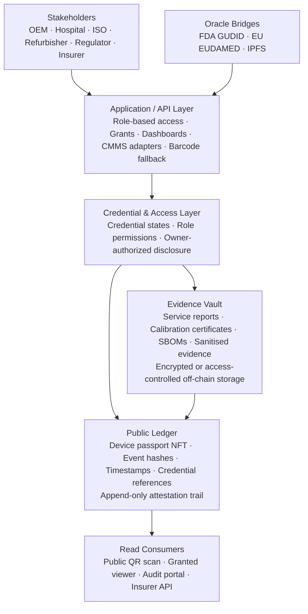

<div align="center">

# MedPassport Protocol

## The cross-organizational evidence layer for regulated medical devices

[](LICENSE)
[](https://soliditylang.org/)
[](https://polygon.technology/)
[]()
[]()
[](https://github.com/tomer-saar/medpassport-protocol/actions/workflows/test.yml)

<br/>

MedPassport is an open-source protocol that creates **permanent, independently verifiable lifecycle records** for high-risk medical devices - preserving service, ownership, calibration, software, and compliance evidence across the organizational boundaries where OEM clouds, CMMS platforms, QMS databases, and local records lose continuity.

<br/>

[Whitepaper](docs/WHITEPAPER.md) &nbsp;·&nbsp;
[Architecture](#architecture) &nbsp;·&nbsp;
[Security & Privacy](#security-privacy) &nbsp;·&nbsp;
[Dual-Market Readiness](#dual-market-readiness---eu-and-us) &nbsp;·&nbsp;
[Quick Start](#quick-start) &nbsp;·&nbsp;
[Roadmap](#roadmap)

</div>

---

## Current Public Status

MedPassport is currently a **TRL 5 testnet protocol**.

- **10 smart contracts** live on Polygon Amoy testnet
- **100 automated Foundry tests** passing, with GitHub Actions CI enabled
- **FDA GUDID bridge** live and verified against AccessGUDID
- **EU EUDAMED bridge** live against public EU Commission endpoints
- **IPFS document uploader** live via Pinata
- **VaultService bridge** implemented for IPFS upload + on-chain hash anchoring; final on-chain write path pending a scheduled contract redeployment
- **Public website and interactive demo** available for stakeholder walkthroughs

The public repository contains the open protocol surface. Detailed enterprise architecture, access-tier decisions, custody models, and pilot-specific operating documents are maintained privately while the design and IP position continue to mature.

This section reflects current status as of the last update. The CI badge at the top of this file always shows the live, up-to-the-minute test result.

---

## The Problem in Three Paragraphs

**The regulatory pressure:** EU MDR post-market surveillance, PSUR obligations, EUDAMED traceability, FDA QMSR service records, and emerging Digital Product Passport expectations all require device-level evidence that persists across ownership transfers, service providers, and decades of operational life.

**The architectural gap:** No existing single-organization system can create a neutral, tamper-evident record that manufacturers, hospitals, refurbishers, independent service organizations, insurers, and regulators can all trust. Proprietary OEM clouds stop at the contract boundary. CMMS systems stop at the organizational boundary. EUDAMED and GUDID identify devices, but they do not record what happens to each physical device after it leaves the manufacturer's direct control.

**MedPassport's answer:** An open protocol that turns the device UDI into a cryptographic passport - carrying signed attestations from every credentialed actor who touches the device, from manufacture to service, resale, refurbishment, audit, and end-of-life.

---

## The Four Structural Gaps

High-risk medical devices - Class IIb/III systems such as CT, MRI, EEG, cardiology, and other capital equipment - operate under strict regulation but move through a fragmented chain:

**OEM → distributor → hospital → ISO service organization → refurbisher → secondary buyer**

At every organizational handoff, existing systems lose continuity. The failure is not technological; it is architectural. Every system serves one organization, while the device lifecycle crosses many.

| Gap | The structural problem | Compliance consequence |
|---|---|---|
| **A - Legacy / disconnected devices** | Many high-risk devices operate for years without continuous cloud connectivity or with local service records only. | PSUR evidence gaps, incomplete audit trails, and weak field traceability. |
| **B - Ownership transfer breaks the chain** | When a device changes owner, the manufacturer's direct service record and visibility often stop. | OEM PMS obligations continue, but the evidence trail becomes fragmented. |
| **C - Independent service dead zone** | ISO and third-party service events often stay outside OEM systems and are difficult to verify later. | Incomplete service history, disputed liability, and weak evidence for maintenance quality. |
| **D - Lack of independent evidence** | Records controlled only by one commercial party carry lower evidentiary weight in disputes and audits. | Regulators, notified bodies, insurers, and buyers must reconstruct evidence manually. |

---

## Secondary Market Trust

The refurbished medical equipment market is a large and growing global category. MedPassport addresses the trust gap inside that market: verified service history, calibration evidence, software state, ownership transfer, recall status, and certification status that can follow a device across resale and refurbishment.

MedPassport does not determine whether a refurbished, reprocessed, or remanufactured device may be placed on the market. Regulatory responsibility remains with the relevant manufacturer, refurbisher, remanufacturer, importer, distributor, hospital, or other economic operator. The protocol provides a neutral evidence layer that can support buyer confidence, audit readiness, and controlled disclosure without exposing patient data or commercial service notes.

---

## Protocol Design Principles

| Principle | Public implementation concept |
|---|---|
| **Every write is a signed attestation** | Lifecycle events are written by credentialed actors; anonymous writes do not exist. |
| **Append-only integrity** | Nothing is deleted or overwritten. Corrections are appended as new records that reference the original. |
| **Zero-PII on-chain** | The ledger contains hashes, timestamps, UDI-linked metadata, and credential references - not patient data, pricing, or personal information. |
| **Neutral scoring** | Compliance reflects device condition and evidence quality, not vendor loyalty. OEM and qualified ISO service can both receive full credit for valid work. |
| **Credential-based write authority** | Write permissions are determined by role and credential status, not by commercial relationships. |
| **Owner-controlled disclosure** | Sensitive evidence is shared through role-based access and owner-authorized grants, not exposed publicly by default. |
| **Walletless enterprise UX** | Enterprise users interact through portals, SSO, CMMS workflows, or barcode flows; they do not manage blockchain wallets or native tokens. |
| **Open protocol, managed network** | Smart contracts and schemas are open-source. Enterprise dashboards, integrations, validation, and hosting can be provided as managed services. |

For the formal constitutional rules, see [ADR-000 Protocol Axioms](docs/adrs/ADR-000-protocol-axioms.md).

---

## Architecture

MedPassport separates **private operational data**, **role-gated evidence**, and **public proof**.



### Public vs authorized access

The public verification layer is intentionally narrow:

- **Public users** may verify device identity and active recall status.
- **Device owners** access the full evidence history for devices they own.
- **Notified bodies / regulators** access audit evidence through role-based or owner-initiated audit grants.
- **Granted viewers** such as buyers or underwriters may receive limited compliance information when the device owner authorizes disclosure.
- **Sensitive documents** such as service reports, calibration certificates, internal notes, pricing, and personal data are never public by default.

This preserves the protocol's transparency while protecting commercial and personal data.

---

## Smart Contract Stack

Ten contracts are deployed in dependency order on Polygon Amoy testnet.

| Layer | Contract | Purpose |
|---|---|---|
| **Types** | `DeviceTypes.sol` | Shared enums and structs - the protocol dictionary |
| **Access** | `CredentialRegistry.sol` | Credential lifecycle: ACTIVE, REVOKED, INACTIVE, MIGRATED |
| **Access** | `RoleManager.sol` | Role-based permission enforcement for write paths |
| **Access** | `MigrationGovernance.sol` | Multisig credential succession and organizational migration |
| **Core** | `DevicePassportNFT.sol` | ERC-721 device identity token anchored to UDI |
| **Core** | `ServiceLogRegistry.sol` | Append-only lifecycle event log |
| **Core** | `CorrectionRegistry.sol` | Correction chain: SUPERSEDES, DISPUTES, AMENDS |
| **Core** | `TransferManager.sol` | Dual-signature ownership transfer with 72-hour expiry |
| **Compliance** | `ComplianceScorer.sol` | Decay-from-100 compliance score |
| **Compliance** | `CertificationSBT.sol` | ERC-5192 soulbound trust stamp: Bronze, Silver, Gold |

---

## Compliance Scoring Model

MedPassport evaluates each device's evidence completeness across categories such as calibration, preventive maintenance, inspection, software currency, parts integrity, and unresolved safety events. Certification tiers (Bronze, Silver, Gold) summarize this evidence state at a glance. The underlying scoring methodology is being calibrated against real pilot field data and is not yet finalized.

Scoring is a transparency tool, not a replacement for regulatory judgment, clinical evaluation, or manufacturer QMS obligations.

---

## Data Collection Paths

MedPassport supports two complementary evidence-capture paths.

| Path | Description | Intended use |
|---|---|---|
| **Path A - CMMS integration** | A closed work order in a CMMS or service system triggers structured evidence capture and on-chain attestation. | OEM, hospital, or service organizations with IT integration available. |
| **Path B - Barcode / mobile fallback** | A technician scans a device barcode and submits a structured service event with supporting evidence. | Pilot sites, offline environments, refurbishers, and organizations without immediate CMMS integration. |

Both paths produce the same output: a signed lifecycle attestation anchored to the device passport.

---

## Security & Privacy

### Three-layer data architecture

| Layer | What belongs here | Public? |
|---|---|---|
| **Layer 1 - Source systems** | CMMS, QMS, ERP, pricing, contracts, full internal notes | No |
| **Layer 2 - Evidence vault** | Service reports, calibration certificates, SBOMs, sanitized evidence documents | Role-gated |
| **Layer 3 - Public ledger** | Hashes, timestamps, credential references, device/event metadata | Yes |

### Privacy principles

- No patient data is in scope.
- No PHI or PII is written on-chain.
- Document content is stored off-chain.
- On-chain records prove that evidence existed at a time, under a credential, without exposing the document itself.
- High-risk actions such as ownership transfer and certification require two independent signatures.
- Production enterprise deployments are expected to use enterprise-grade key management, audit logging, and security review before mainnet use.

---

## Regulatory Alignment

MedPassport is designed as an evidence layer for device lifecycle traceability, not as a replacement for an OEM's QMS, regulatory reporting system, complaint system, or EUDAMED/GUDID registration obligations. It also does not replace jurisdiction-specific rules for resale, refurbishment, servicing, reprocessing, remanufacturing, import, or placing a device back on the market.

| Framework | Jurisdiction | MedPassport relevance |
|---|---|---|
| **ISO 13485:2016** | Global | Traceability, control of records, feedback, servicing evidence |
| **EU MDR 2017/745** | EU | UDI continuity, PMS evidence, FSCA execution support |
| **EUDAMED** | EU | Complements device registration with post-registration lifecycle evidence |
| **FDA QMSR / 21 CFR 820** | US | Service records, traceability, CAPA trend evidence, supplier/service visibility |
| **FDA GUDID** | US | UDI-DI validation at device registration |
| **21 CFR Part 11** | US | Electronic record integrity, audit trail, attribution |
| **EU ESPR Digital Product Passport** | EU | DPP-aligned architecture for future lifecycle transparency requirements |

---

## Dual-Market Readiness - EU and US

| Market | Registry / framework | Status |
|---|---|---|
| EU | EUDAMED public device data | Bridge implemented against public endpoints |
| US | FDA GUDID / AccessGUDID | Bridge live and verified |
| Dual-market | UDI-linked passport model | Designed for single protocol deployment across jurisdictions |

EUDAMED and GUDID identify devices. MedPassport records what happens to those devices throughout their operational life.

---

## Competitive Positioning

| Capability | Traditional CMMS / OEM cloud | Generic DPP / supply-chain ledger | MedPassport |
|---|---|---|---|
| Cross-organizational service evidence | Limited | Partial | Core design |
| Device-level medical regulatory context | Limited | Usually no | Built in |
| UDI-linked lifecycle record | Partial | Sometimes | Core design |
| Neutral evidence layer | No - controlled by one organization | Varies | Core design |
| Zero-PII public ledger model | N/A | Varies | Core design |
| Works with CMMS and fallback capture | Usually one or the other | Rare | Both paths |
| Dual-signature high-risk workflows | No | Rare | Built in |

---

## Public Documentation

| Document | Description |
|---|---|
| [Whitepaper](docs/WHITEPAPER.md) | Public market and regulatory thesis - problem, solution, business model, and Web3 category fit. For live technical status and proof, this README and its CI badge are the source of truth. |
| [ADR-000 Protocol Axioms](docs/adrs/ADR-000-protocol-axioms.md) | Constitutional protocol rules that every contract and workflow must uphold |

Detailed architecture ADRs, access-tier framework, custody model, and pilot-readiness documents are maintained privately during the current design and IP phase.

---

## Quick Start

```bash
git clone https://github.com/tomer-saar/medpassport-protocol.git
cd medpassport-protocol
forge install
forge build
forge test
```

Expected baseline: all public Foundry tests pass on the current main branch.

---

## Roadmap

### Completed

- Protocol axioms and event model established
- Credential registry, role manager, migration governance implemented
- Device passport NFT, service event log, correction registry, and transfer manager implemented
- Compliance scorer and certification SBT implemented
- Deployment scripts and live demo workflow created
- FDA GUDID bridge implemented and verified
- EU EUDAMED bridge implemented against public endpoints
- Polygon Amoy testnet deployment completed
- IPFS uploader and VaultService bridge implemented
- Public website and interactive stakeholder demo launched

### Current / Next

- Completing VaultService's on-chain write path and production data flow
- Building mobile/PWA evidence capture and CMMS integration adapters
- Preparing for external smart-contract security review
- Validating the protocol with real pilot stakeholder participation

### Later

- Production-grade vault encryption and enterprise access controls
- Enterprise credential and SSO infrastructure
- Mainnet deployment following security audit and pilot validation
- Expanded evidence-access APIs for additional stakeholder types
- Long-term archival storage for evidence retention

---

## Demo Snapshot

```text
PASSPORT STATUS - Demo Device
=============================
Device identity: UDI-linked passport token
Lifecycle events: PM · Calibration · Inspection · Software update
Compliance score: Derived from service evidence
Certification: Bronze / Silver / Gold when thresholds are met
Recall status: Publicly visible active recall flag
Evidence model: Document hash anchored on-chain, content off-chain
=============================
```

The demo illustrates the protocol flow only. Production use requires partner onboarding, security review, legal agreements, and pilot-specific validation.

---

## Business Model

MedPassport follows an **open protocol + managed network** model.

The smart contracts and public schemas are open-source under MIT. Commercial services may include hosted infrastructure, dashboards, validation support, CMMS integration, audit exports, and enterprise onboarding.

Pricing, ROI analysis, and pilot definitions are not published in the open repository.

---

## Author

**Tomer Saar**  
An entrepreneur with 20+ years of experience in the medical device industry - R&D, engineering, and manufacturing management at Tier-1 global manufacturers. Now building MedPassport: a blockchain-based evidence protocol with the specific architecture and access controls medical device companies need to bring regulated, cross-organizational lifecycle records onto a neutral, verifiable ledger.

[](https://www.linkedin.com/in/tomer-saar/)

**Research Lead & Industry Advisor: Dr. Shlomo Gilat**  
DSc Biomedical Engineering, Technion · 35+ years Class IIb/III · 2 US patents · 22 publications

---

## Contributing

Contributions are welcome from Solidity developers, medical device professionals, healthcare IT specialists, security researchers, and regulatory technology practitioners.

Recommended contribution areas:

- Smart contract testing
- Foundry test coverage
- Oracle bridge hardening
- Documentation review
- Security review
- Medical-device event taxonomy review

---

## License

MIT License.  
Not legal, medical, regulatory, cybersecurity, or insurance advice.

---

<div align="center">

**If this project is useful to you, please star the repo.**

</div>
