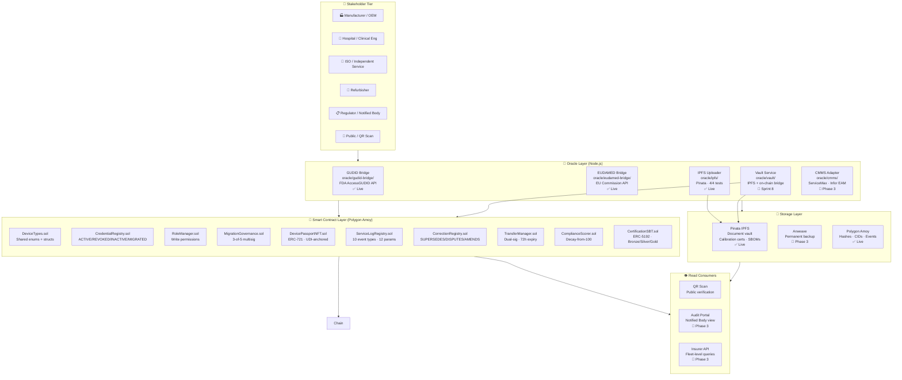

# MedPassport Protocol — System Architecture

> **Living document.** Updated each sprint before code changes.
> Current state: Sprint 8 · May 2026 · TRL 5
> 80 tests passing · Polygon Amoy live · IPFS vault operational

---

## 1. System Overview

MedPassport assigns every medical device a permanent, tamper-evident Digital Product
Passport — carrying lifecycle evidence across the four organizational boundaries where
today's cloud platforms, CMMS systems, and QMS databases go silent.



---

## 2. The Three-Layer Data Architecture

Every piece of data lives in exactly one of three layers.
No data crosses a boundary it should not.

```
┌─────────────────────────────────────────────────────────────────┐
│  LAYER 1 — YOUR SYSTEMS (private, never leaves)                 │
│  CMMS · QMS · ERP · Internal cloud                              │
│  Customer names · Contracts · Pricing · Full service notes      │
│  Who can access: Your RA and service teams only                 │
└──────────────────────────────┬──────────────────────────────────┘
                               │ VaultService uploads
                               ▼
┌─────────────────────────────────────────────────────────────────┐
│  LAYER 2 — ENCRYPTED VAULT (IPFS/Arweave, role-gated)           │
│  Calibration certificates · Service reports · SBOMs             │
│  Sanitised event summaries · Document hashes                    │
│  Who can access: Device owner (full) · Notified Body (grant)    │
│                  ISO actor (own events) · Insurer (paid API)    │
│  Phase 2: plaintext · Phase 3: AES-256-GCM envelope encryption  │
└──────────────────────────────┬──────────────────────────────────┘
                               │ keccak256 hash + CID
                               ▼
┌─────────────────────────────────────────────────────────────────┐
│  LAYER 3 — PUBLIC LEDGER (Polygon Amoy → Mainnet)               │
│  64-char cryptographic hash · Timestamp · CID · Credential ID   │
│  Who can access: Anyone — a competitor sees only a random string │
│  What is NOT here: PII · Service notes · Pricing · Patient data  │
└─────────────────────────────────────────────────────────────────┘
```

---

## 3. Smart Contract Stack

10 contracts deployed in dependency order on Polygon Amoy testnet.

### Deployment order

| # | Contract | Layer | Purpose | Status |
|---|---|---|---|---|
| 1 | `DeviceTypes.sol` | Types | Shared enums and structs — the protocol dictionary | ✅ Live |
| 2 | `CredentialRegistry.sol` | Access | Credential states: ACTIVE/REVOKED/INACTIVE/MIGRATED | ✅ Live |
| 3 | `RoleManager.sol` | Access | Role-based permission enforcement for every write path | ✅ Live |
| 4 | `MigrationGovernance.sol` | Access | M-of-N multisig for credential succession and M&A | ✅ Live |
| 5 | `DevicePassportNFT.sol` | Core | ERC-721 device identity token — one per physical device | ✅ Live |
| 6 | `ServiceLogRegistry.sol` | Core | Append-only lifecycle event log — 10 event types, 12 params | ✅ Live |
| 7 | `CorrectionRegistry.sol` | Core | Dispute and correction chain — SUPERSEDES/DISPUTES/AMENDS | ✅ Live |
| 8 | `TransferManager.sol` | Core | Dual-signature ownership transfer with 72h expiry | ✅ Live |
| 9 | `ComplianceScorer.sol` | Compliance | Decay-from-100 compliance score — configurable per manufacturer | ✅ Live |
| 10 | `CertificationSBT.sol` | Compliance | ERC-5192 soulbound trust stamp — Bronze/Silver/Gold | ✅ Live |

### ServiceLogRegistry — logEvent() signature (12 parameters)

```solidity
function logEvent(
    uint256   tokenId,              // Device passport token ID
    uint8     eventType,            // 0-9: see EventType enum below
    bytes32   documentHash,         // keccak256 of document (PDF/JSON)
    string    ipfsCID,              // IPFS CIDv1 of the document
    bool      passedInspection,     // Overall pass/fail
    string    softwareVersion,      // SW version (SW_UPDATE only, else "")
    string    notes,                // Sanitised event notes
    bool      hasCompatibleParts,   // Non-OEM documented parts used
    bool      hasUndocumentedParts, // Parts used with no documentation
    bool      isSeriousIncident,    // INCIDENT_REPORT: serious vs minor
    bytes32   sbomHash,             // sha256 of SBOM.json (SW_UPDATE only)
    string    sbomCid               // IPFS CIDv1 of SBOM.json (SW_UPDATE only)
) external returns (uint256 eventIndex)
```

### EventType enum

| Code | Name | Who can write | Document required |
|---|---|---|---|
| 0 | PREVENTIVE_MAINTENANCE | OEM · ISO | PM report PDF |
| 1 | CALIBRATION | OEM · ISO | Calibration certificate PDF |
| 2 | INSPECTION | OEM · ISO · Regulator | Inspection report PDF |
| 3 | SOFTWARE_UPDATE | Manufacturer only | Release notes PDF + SBOM JSON |
| 4 | COMPLAINT | Hospital · RA team | Complaint form PDF |
| 5 | FSCA | Manufacturer · Regulator | FSCA notice PDF |
| 6 | DECOMMISSION | Device owner | Decommission record |
| 7 | INSTALLATION | Hospital | Installation record |
| 8 | INCIDENT_REPORT | Hospital · ISO | Incident description PDF |
| 9 | REFURBISHMENT | Refurbisher | Refurbishment report PDF |

### Compliance scoring model

```
New CE-marked device at manufacture:     100/100
PM overdue 0-3 months:                    95/100  (-5)
PM overdue 3-6 months:                    85/100  (-15)
PM overdue 6+ months:                     75/100  (-25, component lost)
Active recall or decommissioned:           0/100  (hard zero)

Component weights (default — configurable per OEM):
  Calibration compliance:   25 pts
  PM compliance:            25 pts
  Inspection compliance:    20 pts
  Software currency:        10 pts
  Parts integrity:          10 pts
  Clean complaint record:   10 pts

Certification thresholds:
  GOLD:   90-100
  SILVER: 75-89
  BRONZE: 60-74
  Below 60: Not certifiable
```

---

## 4. Oracle Layer

Node.js services that bridge the off-chain world to the on-chain contracts.

### 4.1 GUDID Bridge — FDA Validation

```
Location:  oracle/gudid-bridge/GUDIDBridge.js
API:       FDA AccessGUDID (public, no auth)
Status:    ✅ Live — 4/4 tests passing
Verified:  XIENCE ALPINE, Abbott Vascular, Class III
```

**What it does:** Validates a GS1 UDI against FDA GUDID before EU or US passport
mint. Returns deviceClass, brandName, companyName, gudidRef for on-chain storage.

**Run:** `cd oracle/gudid-bridge && node GUDIDBridge.js`

---

### 4.2 EUDAMED Bridge — EU Validation

```
Location:  oracle/eudamed-bridge/EUDAMEDBridge.js
API:       EU Commission EUDAMED (public, no auth)
Status:    ✅ Live — 4/4 tests passing
Verified:  2,042,051 devices accessible · May 2026
Note:      Run from home computer — ec.europa.eu blocked in Codespace egress
```

**What it does:** Validates a Basic UDI-DI against EUDAMED before EU passport mint.
Returns riskClass, certificate (NB, expiry, status), authorisedRep, euAuthorised flag.
Dual-market validation runs GUDID + EUDAMED in parallel via `runDualMarketValidation()`.

**Key fields returned for DevicePassportNFT:**
- `eudamedRef` = `manufacturerSrn/eudamedId`
- `riskClass` = Class I / IIa / IIb / III
- `certificate.status` = VALID / EXPIRED / WITHDRAWN
- `euAuthorised` = boolean mint gate

**Run:** `cd oracle/eudamed-bridge && node EUDAMEDBridge.js`

---

### 4.3 IPFS Uploader

```
Location:  oracle/ipfs/ipfs-uploader.js
Service:   Pinata (pinning) + Arweave (Phase 3 backup)
Status:    ✅ Live — 4/4 tests passing
Tested:    Real Pinata CID returned and verified · May 2026
```

**What it does:** Uploads a document buffer to Pinata IPFS. Returns CID +
keccak256 hash (for documentHash on-chain) + sha256 hash (for sbomHash on-chain).
Verifies round-trip: fetches document from IPFS and confirms hash matches.

**Key functions:**
- `uploadDocument(buffer, filename, metadata)` → `{ cid, keccak256, sha256, size, gateway }`
- `uploadJSON(jsonObject, filename, metadata)` → same, deterministic serialisation
- `verifyDocument(cid, onChainHash)` → `{ verified, fetchedHash }`

**Run:** `cd oracle/ipfs && DOTENV_CONFIG_PATH=../../.env node --require dotenv/config ipfs-uploader.js`

---

### 4.4 Vault Service — IPFS + On-Chain Bridge *(Sprint 8)*

```
Location:  oracle/vault/VaultService.js
Status:    🔨 Built Sprint 8 — pending deployment and Test 4
Depends:   IPFS Uploader · ServiceLogRegistry.sol · PRIVATE_KEY · AMOY_RPC_URL
```

**What it does:** The operational bridge connecting all three layers.
Accepts a document + event metadata → uploads to IPFS → builds all 12 logEvent()
parameters → signs and broadcasts transaction on Polygon Amoy → returns a receipt
with txHash + CID together.

```
Input:  tokenId · eventType · documentBuffer · documentName · metadata
          └── optional: sbomObject + sbomName for SOFTWARE_UPDATE

Flow:   1. uploadToIPFS(documentBuffer)    → cid + keccak256Hash
        2. uploadJSONToIPFS(sbomObject)    → sbomCid + sha256Hash  [SW_UPDATE only]
        3. Build 12-param logEvent() call
        4. getSigner() from PRIVATE_KEY in .env
        5. contract.logEvent(...params)    → txHash
        6. tx.wait(1)                      → blockNumber

Output: {
          txHash, blockNumber, gasUsed,
          cid, keccak256, gatewayUrl,     ← document
          sbomCid, sbomHash, sbomGateway, ← SBOM (SW_UPDATE only)
          tokenId, eventType, network, timestamp
        }
```

**Key functions:**
- `logEventWithDocument(params)` → full vault write + on-chain log
- `buildLogEventParams(...)` → build params without broadcasting (for CMMS adapter)
- `verifyReceipt(receipt)` → fetch from IPFS and confirm hash match
- `uploadToIPFS(buffer, filename)` → direct IPFS upload
- `uploadJSONToIPFS(jsonObject, filename)` → SBOM upload

**Run:** `cd oracle/vault && DOTENV_CONFIG_PATH=../../.env node test-vault.js`
**Test 4 (on-chain):** requires `SERVICE_LOG_ADDRESS` in `.env`

---

### 4.5 CMMS Adapter *(Phase 3 — after pilot partner confirmed)*

```
Location:  oracle/cmms/ (not yet built)
Status:    📅 Phase 3
Depends:   ServiceMax or Infor EAM API credentials from pilot partner
```

**What it will do:** Read closed work orders from the OEM's CMMS. Extract event
data and attached documents. Call VaultService.logEventWithDocument() automatically.
Zero technician action required — Path A.

**Build only** after first real field mapping session with pilot partner.
Requires: specific CMMS system identified, API credentials, joint IT session.

---

## 5. Data Flow — Full Lifecycle

### 5.1 Device passport mint (dual-market)

```
Manufacturer triggers mint
        │
        ├─ GUDID Bridge validates GS1 UDI → gudidRef
        ├─ EUDAMED Bridge validates Basic UDI-DI → eudamedRef, riskClass, certificate
        │
        ▼
DevicePassportNFT.mintDevicePassport(
    owner, udi, deviceClass, model, metadata,
    basicUdiDi, gudidRef, eudamedRef, simulatedDevice
)
        │
        ▼
ERC-721 token minted on Polygon Amoy
ComplianceScore initialised at 100/100
```

### 5.2 Service event — Path B (manual, current demo)

```
Technician scans barcode → ?scan=<id> URL
        │
        ▼
Path B form pre-filled (device identity from URL params)
        │
        ▼
Technician: selects event type · enters outcome · attaches document · submits
        │
        ▼ [Sprint 8 — VaultService]
VaultService.logEventWithDocument()
        ├─ uploadToIPFS(documentBuffer) → cid + keccak256
        ├─ uploadJSONToIPFS(sbomObject) → sbomCid + sha256  [SW_UPDATE only]
        └─ contract.logEvent(12 params) → txHash
        │
        ▼
On-chain: hash + CID + timestamp + credentialId stored
IPFS: document available at gateway URL
ComplianceScorer: score updated automatically
```

### 5.3 Ownership transfer

```
Proposer calls TransferManager.proposeTransfer(tokenId, newOwner)
        │
        ▼ 72-hour window
New owner calls TransferManager.confirmTransfer(proposalId)
        │
        ▼
DevicePassportNFT: ownership updated
Full read access transfers to new owner automatically
Compliance score and full history preserved
```

### 5.4 Certification

```
Certifier proposes: CertificationSBT.proposeCertification(tokenId, level)
        │
        ▼
Device owner confirms: CertificationSBT.confirmCertification(proposalId)
        │
        ▼
ERC-5192 soulbound token minted at Bronze/Silver/Gold level
Token is non-transferable — tied to device, not owner
Visible on QR scan immediately
```

---

## 6. Access Control

Full design in ADR-012. Summary:

### Write authority (enforced on-chain — RoleManager.sol)

| Actor | Credential type | Can write |
|---|---|---|
| OEM / Manufacturer | MANUFACTURER | Mint, SW_UPDATE, FSCA, COMPLAINT |
| ISO technician | SERVICE_ORG | PM, CALIBRATION, INSPECTION, INCIDENT |
| Hospital | HOSPITAL | INSTALLATION only |
| Regulator | REGULATOR | FSCA activation/clearance |
| Refurbisher | REFURBISHER | REFURBISHMENT, transfer initiation |

**Constitutional rule (Axiom 6):** Any credentialed actor may write to any device
record within their role permissions. No commercial relationship — including OEM
service contracts — can prevent a credentialed actor from logging an event.
Enforced in RoleManager.sol — not a policy, an architectural constraint.

### Read authority (vault decryption — Phase 3, ADR-012)

| Actor | Can decrypt | Cannot decrypt |
|---|---|---|
| OEM | All events for their devices | Other OEM's devices |
| Device owner | All events for owned devices | Events after transfer |
| ISO technician | Events they wrote | Other ISO events on same device |
| Notified Body | Full audit evidence for assigned device scope — events, calibration certs, FSCA records | Configurable time-limited grant, initiated by device owner. Read-only. |
| Insurer (paid) | Score, event count, cert status, event types and outcomes | Commercial API tier — no service notes, no PII. Paid subscription. |
| Granted viewer (per-transaction) | Compliance score, certification status, event count | Granted by device owner per transaction — buyer, hospital procurement, insurance underwriter. No document content. |
| Public (no grant required) | Active recall flag only | Safety-critical. Always visible. No score, no history, no certification status. |

**Phase 2 (current):** Documents stored as plaintext on IPFS. Acceptable for
testnet pilot — no real commercial data. Hash integrity proof still works correctly.

**Phase 3:** AES-256-GCM envelope encryption. Each document encrypted with a
unique DEK, wrapped separately per authorized role. No trusted intermediary.

**Known design tension:** `ComplianceScorer.getScore(tokenId)` is publicly
queryable at the smart contract layer — the on-chain score is not encrypted.
The application layer controls score visibility by requiring a Granted viewer
authorization before exposing scores in any UI or API. This is a deliberate
trade-off: operator-free architecture requires public ledger transparency at
Layer 3. See ADR-012 for full discussion.

**CAPA traceability scope:** MedPassport does not replace the OEM's complaint
management system. When a corrective action involves an ISO technician,
MedPassport independently verifies the corrective service event was executed
by a credentialed actor. The OEM QMS remains the system of record for the
complaint lifecycle. MedPassport closes the cross-organizational evidence gap.

---

## 7. Regulatory Alignment

| Framework | Jurisdiction | Key coverage | Status |
|---|---|---|---|
| ISO 13485:2016 | Global | §7.5.8 Traceability · §8.2.1 Feedback · §8.3 Nonconforming | ✅ |
| EU MDR 2017/745 | EU | Art. 27 UDI · Art. 83 PMS · Art. 87 FSCA | ✅ |
| EUDAMED | EU | MedPassport relevant to post-registration PMS evidence (module 4) and VGL vigilance reporting — not device registration. EUDAMED bridge validates device UDI before passport mint. | ✅ Bridge live |
| EUDAMED VGL | EU | Vigilance & PMS module mandatory ~Q2 2027 | 📅 Phase 3 |
| EU ESPR 2024/1781 | EU | DPP-ready architecture · Medical device delegated act 2027-28 | ✅ |
| FDA QMSR 21 CFR 820 | US | §820.10 UDI · §820.35 Records · §820.65 Traceability | ✅ |
| FDA GUDID | US | Live UDI-DI validation bridge · AccessGUDID API verified | ✅ Bridge live |
| 21 CFR Part 11 | US | Audit trail · unique identification · record retrieval | ✅ |
| FDA SBOM 524B | US | SW_UPDATE events capture version + sbomHash + sbomCid | ✅ |

---

## 8. Deployment

### Polygon Amoy testnet (live)

```
Network:   Polygon Amoy (chainId: 80002)
Wallet:    0xA9d53cCfbc80fd13D91F2e46bB6Eca388295745f
Faucet:    faucet.polygon.technology
Explorer:  amoy.polygonscan.com

Deployed contracts: 9 contracts live on Amoy
Addresses: broadcast/DeployAll.s.sol/80002/run-latest.json

SERVICE_LOG_ADDRESS: add to .env from run-latest.json for VaultService Test 4
```

### Environment variables (.env — never commit)

```
PRIVATE_KEY=0x...              # Polygon Amoy wallet
AMOY_RPC_URL=https://...       # Alchemy or public Amoy RPC
PINATA_JWT=eyJ...              # Pinata IPFS pinning
POLYGONSCAN_API_KEY=...        # Optional — contract verification
ANTHROPIC_API_KEY=sk-ant-...   # Claude Code (optional)
SERVICE_LOG_ADDRESS=0x...      # ServiceLogRegistry on Amoy (add from deployment)
```

### Test status

```
forge test --summary

Suite                   Passed   Failed
──────────────────────────────────────
ComplianceTest            28        0
CredentialRegistryTest    22        0
DevicePassportTest        30        0
──────────────────────────────────────
Total                     80        0    ✅

Oracle tests:
  GUDID bridge:     4/4 ✅  (live FDA API)
  EUDAMED bridge:   4/4 ✅  (live EU Commission API — run from home)
  IPFS uploader:    4/4 ✅  (live Pinata)
  VaultService:     6/7 🔨  (Test 7 requires credential registration on Amoy)
```

### Local development

```bash
# Start local node
anvil

# Deploy all contracts locally
forge script script/foundry/DeployAll.s.sol \
  --rpc-url http://127.0.0.1:8545 \
  --broadcast --private-key <key>

# Run live demo script
forge script script/foundry/LiveDemo.s.sol \
  --rpc-url http://127.0.0.1:8545 \
  --broadcast --private-key <key>

# Run tests
forge test --summary

# GUDID bridge
cd oracle/gudid-bridge && node GUDIDBridge.js

# EUDAMED bridge (home computer only)
cd oracle/eudamed-bridge && node EUDAMEDBridge.js

# IPFS uploader
cd oracle/ipfs && DOTENV_CONFIG_PATH=../../.env node --require dotenv/config ipfs-uploader.js

# Vault service
cd oracle/vault && DOTENV_CONFIG_PATH=../../.env node test-vault.js
```

---

## 9. Open Items by Phase

### Sprint 8 (current)

- [x] EUDAMED bridge — live, 4/4 tests
- [x] VaultService — built, Tests 1-6 passing (Test 7 requires credential registration on Amoy)
- [x] SEQUENCE-DIAGRAMS.md — v2.0 pushed to docs/architecture/ (4 complete Mermaid diagrams)
- [x] CLAUDE.md — updated May 2026 (80 tests, 12-param logEvent, EUDAMED + VaultService)
- [x] Google Analytics — GA4 live on all 4 medpassport.io pages (G-BX3RV3FE4T)
- [ ] VaultService Test 7 — credential registration on Amoy required
- [ ] Path B production — real mobile form replacing demo version

### Phase 2 (next)

- [ ] EUDAMED bridge Phase 2 — authenticated endpoints (NB/Certificates, Vigilance)
- [ ] Path B production mobile form — not demo only
- [ ] Polygon mainnet deployment — after first LOI signed
- [ ] Arweave backup — permanent storage layer alongside Pinata

### Phase 3 (after pilot partner confirmed)

- [ ] CMMS adapter — ServiceMax / Infor EAM (requires pilot partner IT session)
- [ ] AES-256-GCM vault encryption — ADR-012 implementation
- [ ] Envelope encryption per role — CredentialRegistry public keys
- [ ] Notified Body audit portal — read-only grant flow
- [ ] Insurer API — fleet-level paid access
- [ ] DiscrepancyRegistry.sol — unauthorized intervention detection
- [ ] EUDAMED VGL module bridge — digital PSUR submission feed
- [ ] MedPassport Studio — low-code CMMS field mapper (after first mapping session)

---

## 10. ADR Index

| ADR | Title | Status |
|---|---|---|
| ADR-000 | Protocol Axioms — 6 constitutional rules | Accepted |
| ADR-001 | Credential States — role matrix and transitions | Accepted |
| ADR-010 | VeChain competitive learnings | Accepted |
| ADR-011 | Access Tier Framework — monetization with neutrality | Proposed |
| ADR-012 | Vault Access Control — envelope encryption model | Proposed |

---

## 11. How to Update This Document

**When to update:** First commit of every sprint, before any code changes.

**What to update:**

| Section | Update trigger |
|---|---|
| Status badges (✅ 🔨 📅) | Any contract or oracle deployment |
| logEvent() signature | Any parameter change to ServiceLogRegistry |
| Test counts | After forge test or oracle test run |
| Open items | End of each sprint |
| Deployment addresses | After any Amoy or mainnet deployment |
| Regulatory alignment | When a new framework is confirmed or a deadline passes |

**What NOT to put here:** Business strategy, pricing, pilot partner names,
investor details. Those belong in the private strategy document.

---

*MedPassport Protocol · MIT License · Not legal or regulatory advice*
*Author: Tomer Saar · Last updated: May 2026 · Sprint 8 complete — access control model updated*
