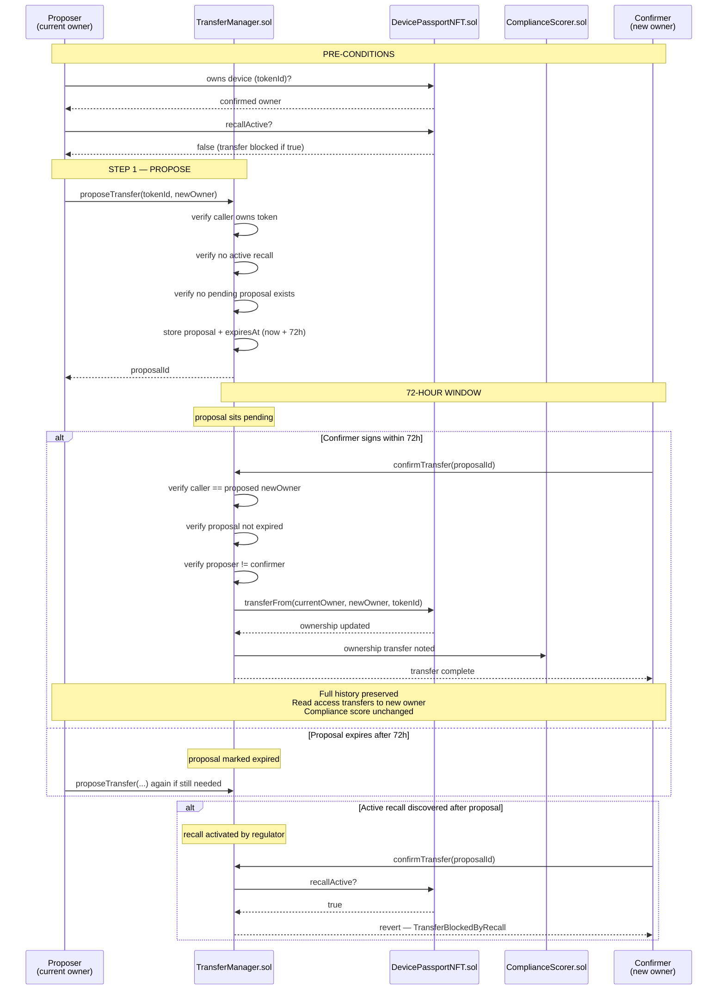
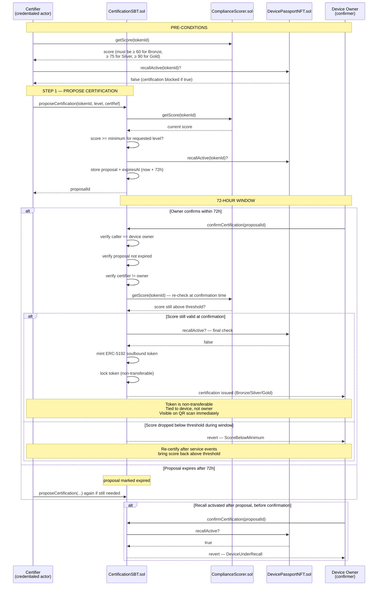
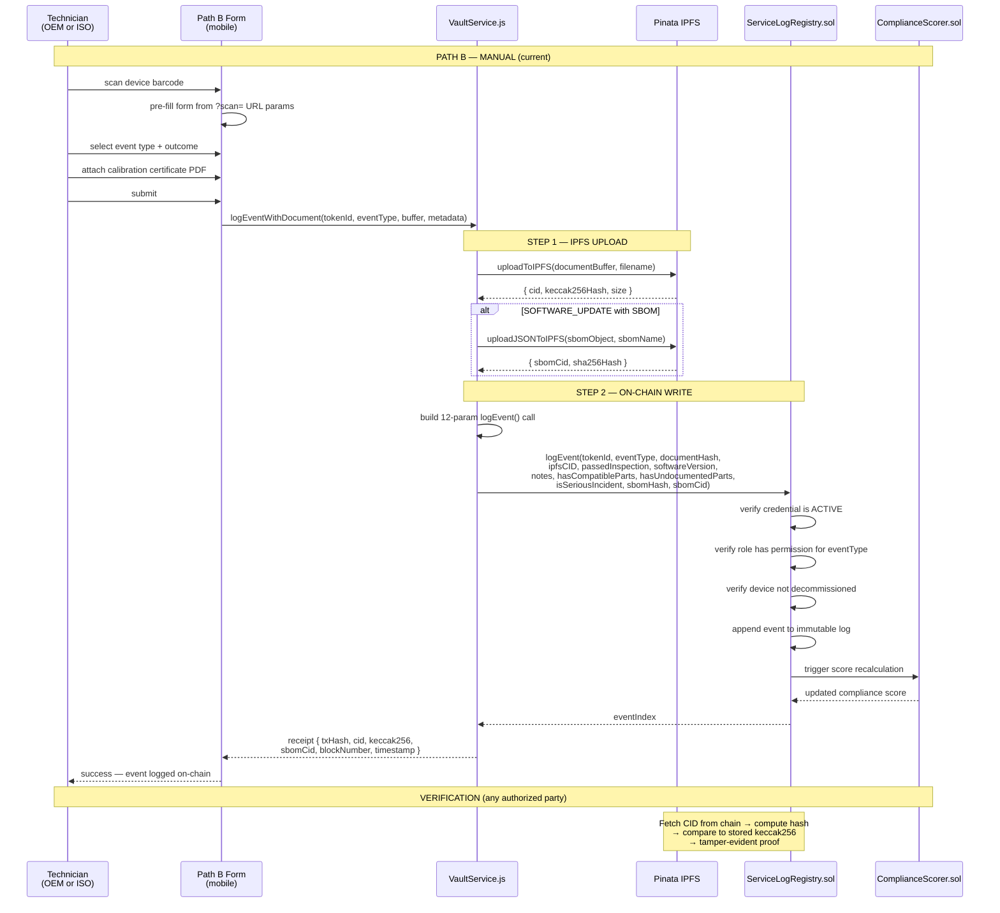
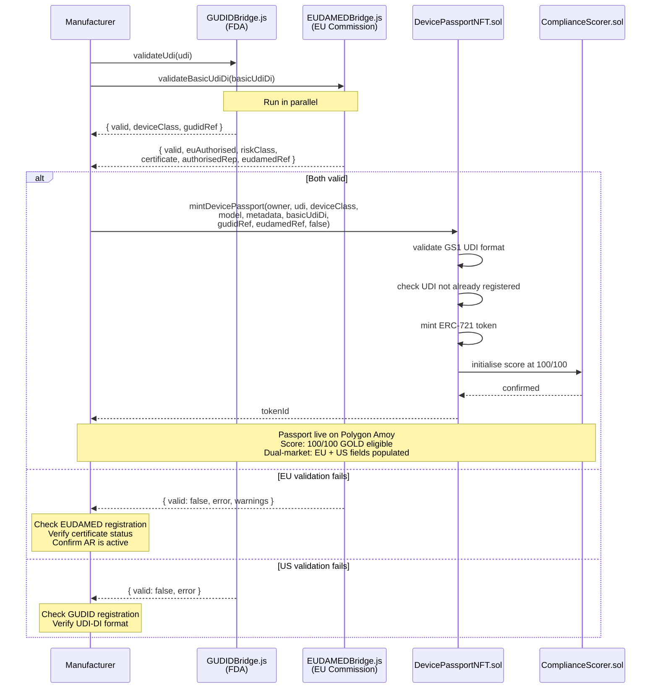

# MedPassport — Sequence Diagrams v2.0

**Status:** Accepted
**Date:** May 2026 (rebuilt from contracts — v1.0 was truncated)
**Author:** Tomer Saar, PMP

---

## Overview

These diagrams define the exact step-by-step flows for the two
highest-risk workflows in the MedPassport protocol. Both require
dual-signature and are enforced by TransferManager.sol and
CertificationSBT.sol respectively.

Both flows share the same governance principle:
**No single party can complete a high-risk action unilaterally.**

---

## Diagram 1 — Ownership Transfer

Covers transfer of a device from any current owner (refurbisher,
distributor, hospital) to a new owner. Both parties must sign
independently within a 72-hour window. An active recall blocks
the transfer entirely.



### Key rules enforced on-chain

| Rule | Enforced by | Consequence if violated |
|---|---|---|
| Only current owner can propose | TransferManager | revert — not owner |
| Active recall blocks transfer | TransferManager → DevicePassportNFT | revert — TransferBlockedByRecall |
| Proposer cannot be confirmer | TransferManager | revert — SameActorForbidden |
| 72-hour expiry | TransferManager | revert — ProposalExpired |
| One pending proposal at a time | TransferManager | revert — ProposalAlreadyPending |

### What transfers automatically

- Device ownership (ERC-721 token)
- Full read access to vault documents
- Compliance score and full service history
- Certification SBT remains on device (non-transferable to new owner but stays on device record)

### What does NOT transfer

- OEM service contract (commercial relationship — off-chain)
- Warranty status (manufacturer determines independently)
- Credentials of previous actors (remain with those actors)

---

## Diagram 2 — Certification (Bronze / Silver / Gold)

Covers the issuance of an ERC-5192 soulbound certification token.
Requires: compliance score above minimum threshold, two independent
credentialed actors, no active recall.



### Certification levels and thresholds

| Level | Min score | Typical state |
|---|---|---|
| GOLD | 90-100 | All service on schedule, no incidents, software current |
| SILVER | 75-89 | Minor deductions — one overdue PM or compatible parts used |
| BRONZE | 60-74 | Multiple deductions — device still serviceable, below optimal |
| Not certifiable | < 60 | Significant compliance gaps — address before certifying |
| Hard zero | 0 | Active recall or decommissioned — certification impossible |

### Key rules enforced on-chain

| Rule | Enforced by | Consequence if violated |
|---|---|---|
| Score must meet level threshold | CertificationSBT → ComplianceScorer | revert — ScoreBelowMinimum |
| Active recall blocks certification | CertificationSBT → DevicePassportNFT | revert — DeviceUnderRecall |
| Certifier cannot be owner | CertificationSBT | revert — SameActorForbidden |
| Score re-checked at confirmation | CertificationSBT | revert if score dropped |
| 72-hour expiry | CertificationSBT | revert — ProposalExpired |
| Token is non-transferable | ERC-5192 locked() = true | transfer reverts |

### Certification revocation

```mermaid
sequenceDiagram
    participant Actor as Certifier or Regulator
    participant SBT as CertificationSBT.sol

    Actor->>SBT: revokeCertification(tokenId)
    SBT->>SBT: verify caller is certifier or REGULATOR role
    SBT->>SBT: mark certification revoked
    SBT->>SBT: burn soulbound token
    SBT-->>Actor: certification revoked
    Note over Actor,SBT: Score not changed by revocation<br/>New certification possible after<br/>service events bring score up
```

---

## Diagram 3 — Vault Service Event (Sprint 8)

Covers the full flow of a service event with document upload —
from technician action to on-chain attestation. Added Sprint 8
with VaultService.js operational.



---

## Diagram 4 — Dual-Market Passport Mint

Covers the mint flow for a device placed on both EU and US markets.
Both GUDID and EUDAMED validation run in parallel before minting.



---

## Update Log

| Version | Date | Changes |
|---|---|---|
| v1.0 | April 2026 | Initial — Diagrams 1-2 (truncated, diagrams missing) |
| v2.0 | May 2026 | Rebuilt complete — all Mermaid diagrams added · Diagrams 3-4 added for VaultService and dual-market mint |

---

*MedPassport Protocol · MIT License · Not legal or regulatory advice*
*Author: Tomer Saar, PMP · Last updated: May 2026 · Sprint 8*
